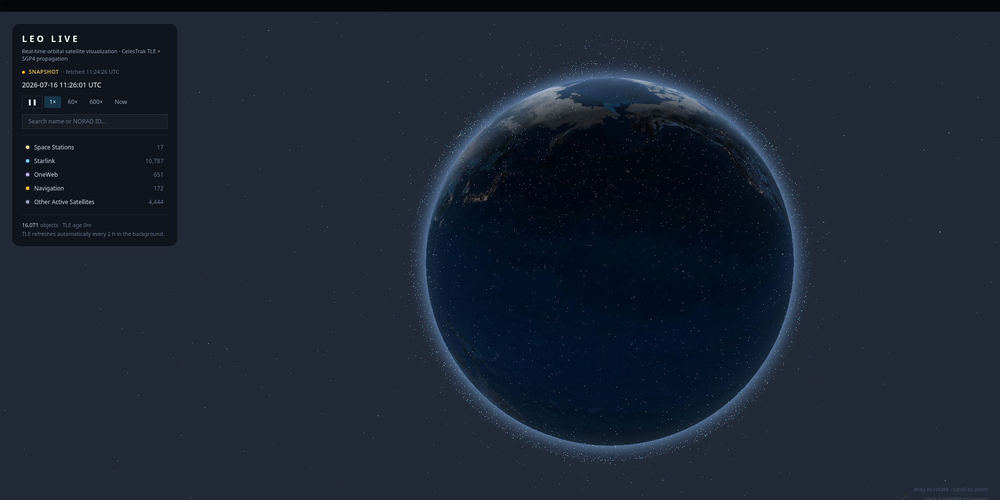
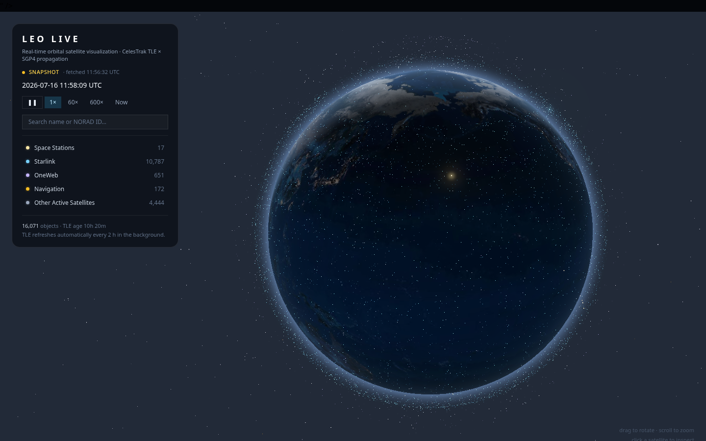
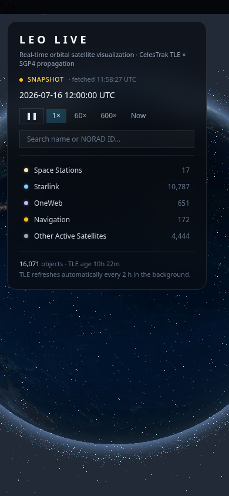

<div align="center">

<br />


<br /><br />

```text
   █████╗ ███████╗████████╗██████╗  ██████╗ ██████╗ ███╗   ██╗██████╗ ███████╗██████╗
  ██╔══██╗██╔════╝╚══██╔══╝██╔══██╗██╔═══██╗██╔══██╗████╗  ██║██╔══██╗██╔════╝██╔══██╗
  ███████║███████╗   ██║   ██████╔╝██║   ██║██████╔╝██╔██╗ ██║██████╔╝█████╗  ██████╔╝
  ██╔══██║╚════██║   ██║   ██╔══██╗██║   ██║██╔══██╗██║╚██╗██║██╔══██╗██╔══╝  ██╔══██╗
  ██║  ██║███████║   ██║   ██║  ██║╚██████╔╝██████╔╝██║ ╚████║██████╔╝███████╗██║  ██║
  ╚═╝  ╚═╝╚══════╝   ╚═╝   ╚═╝  ╚═╝ ╚═════╝ ╚═════╝ ╚═╝  ╚═══╝╚═════╝ ╚══════╝╚═╝  ╚═╝
```

### **ASTROBENDER** — Güneş Sistemi, Dünya yörüngesi ve canlı uzay verileri için etkileşimli 3B gözlemevi.

**JPL tabanlı yörüngeler** · **SGP4 uydu yayılımı** · **TR / EN arayüz** · **tarayıcıda WebGL**

</div>

---

## ✦ Genel Bakış

**ASTROBENDER**, Güneş Sistemi'ni ve Dünya çevresindeki yapay uyduları aynı Three.js sahnesinde incelemek için geliştirilmiş etkileşimli bir web uygulamasıdır. Gezegenlere veya uydularına tıklayarak hedefe uçabilir; fiziksel profilini, kimyasını ve bilim notlarını inceleyebilirsin.

Uygulama, astronomik yörünge sırasını ve görece yapıyı korur; ancak milyarlarca kilometrelik uzay mesafelerini tarayıcıda gezilebilir tutmak için görsel olarak sıkıştırır. Bu nedenle sahne ölçeği temsili, gösterilen astronomik değerler ise gerçek kaynak değerleridir.

<div align="center">
  
  <sub><i>Dünya varsayılan hedef olarak açılır; parlak uydu noktaları ve Dünya yüzey katmanları korunur.</i></sub>
</div>

---

## ⚡ Öne Çıkan Özellikler

| Özellik | Açıklama |
|---|---|
| 🌍 **Canlı 3B Dünya** | Gündüz/gece dokuları, bulut katmanı, yüzey parlaklığı ve yapay uydu noktalarıyla Dünya görünümü. |
| 🪐 **Gezegen ve uydu sistemleri** | Güneş, sekiz gezegen, cüce gezegenler ve seçilebilir büyük uydular; halkalı dev gezegen sistemleri. |
| 🧪 **Fiziksel profil** | Seçilen cisim için kütle, yoğunluk, yüzey yerçekimi, sıcaklık, kimya/yüzey özeti ve bilim notu. |
| 🛰️ **TLE + SGP4** | CelesTrak TLE paketleri, `satellite.js` ile tarayıcıda yörünge yayılımı ve IndexedDB önbelleği. |
| 🔭 **Dünya Gözlemevi** | NASA EONET olayları, USGS depremleri ve NOAA aurora öngörüsünü kaynak bağlantılarıyla katman olarak açar. |
| ☄️ **Küçük cisimler** | JPL Close Approach Data üzerinden yakın geçişler; asteroit, kuyrukluyıldız ve kuşak katmanları. |
| ✨ **Takımyıldızlar ve sondalar** | 88 IAU takımyıldızı ile derin uzay görevlerini aynı gözlem akışında sunar. |
| 🎬 **Sinematik uzay turu** | Türkçe ve İngilizce anlatım dosyalarıyla zaman kodlu kamera rotası. |
| 🔎 **Tek arama kutusu** | Gök cismi, uydu, görev, yüzey konumu veya NORAD numarasını tek yerden bulur. |
| 🌐 **TR / EN** | Arayüz, hedef bilgileri ve sinematik tur için iki dil desteği. |

---

## 🧭 Gezegen Konumu ve Ölçek Modeli

Gezegenlerin konumu, JPL Solar System Dynamics'in yaklaşık Kepler elemanlarından hesaplanır. Büyük doğal uydular için JPL J2000 ortalama elemanları kullanılır. Böylece sistemdeki yörünge sırası, göreli yön ve dönem mantığı korunur.

Gerçek Güneş Sistemi ölçeği bir tarayıcı sahnesi için aşırı büyüktür. ASTROBENDER bunun yerine tekdüze bir mesafe sıkıştırması kullanır:

```text
JPL yörünge elemanları ──▶ heliosentrik konum ──▶ görsel mesafe sıkıştırması ──▶ WebGL sahnesi
                                      │
                                      └── AU etiketi gerçek yarı-büyük eksen değerini gösterir
```

- Sahnedeki uzaklıklar **navigasyon için sıkıştırılmıştır**.
- Yörünge sırası ve gezegenler arası göreli yapı **korunur**.
- Arayüzdeki AU değeri, sahnedeki çizim yarıçapı değil; cismin gerçek yarı-büyük eksenidir.
- Uydu sistemleri kendi içlerinde gerçek uzaklık oranlarını koruyan ayrı bir görsel ölçek kullanır.

---

## 🗂️ Veri Kaynakları ve Gerçeklik Notu

| Kaynak | Uygulamada kullanımı | Durum |
|---|---|:---:|
| [JPL SSD — gezegen konumları](https://ssd.jpl.nasa.gov/planets/approx_pos.html) | Gezegenlerin yaklaşık Kepler elemanları ve heliosentrik konumları | ✅ |
| [JPL SSD — doğal uydu elemanları](https://ssd.jpl.nasa.gov/sats/elem/sep.html) | Büyük uyduların yörünge modeli | ✅ |
| [JPL fiziksel parametreleri](https://ssd.jpl.nasa.gov/planets/phys_par.html) | Gezegen ve cüce gezegen fiziksel profilleri | ✅ |
| [JPL uydu fiziksel parametreleri](https://ssd.jpl.nasa.gov/sats/phys_par/) | Doğal uydu fiziksel profilleri | ✅ |
| [CelesTrak](https://celestrak.org/NORAD/elements/) | TLE katalogları ve canlı uydu güncellemesi | ✅ |
| [NASA Solar System Exploration](https://science.nasa.gov/solar-system/) | Bilim notları ve gök cismi açıklamaları | ✅ |
| [NASA EONET](https://eonet.gsfc.nasa.gov/) | Doğal olay katmanı | ✅ |
| [USGS Earthquake Hazards](https://earthquake.usgs.gov/) | Deprem katmanı | ✅ |
| [NOAA SWPC](https://www.swpc.noaa.gov/) | Aurora öngörü katmanı | ✅ |

Fiziksel değerler, panelde okunabilir kalmaları için yuvarlanır. Küçük ve düzensiz bir uydunun kütlesi, yoğunluğu veya yüzey yerçekimi güvenilir biçimde yayımlanmamışsa uygulama değer icat etmez; **“Güvenilir ölçüm yok”** yazar.

> Canlı TLE, Dünya Gözlemevi veya JPL yakın geçiş verisi ağdan alınamazsa uygulama hatayı gizlemez: kaynak ve HTTP/ağ nedeni arayüzde görünür; mevcut geçerli veri kullanılmaya devam eder.

---

## 🛰️ Render ve Veri Akışı

```text
CelesTrak TLE ──▶ IndexedDB önbelleği ──▶ satellite.js / SGP4 ──▶ yapay uydu noktaları

JPL gezegen + uydu elemanları ──▶ orbital-mechanics ──▶ sıkıştırılmış 3B konumlar
                                                         │
NASA / USGS Astrogeology dokuları ──────────────────────┼──▶ Three.js / WebGL sahnesi
                                                         │
NASA EONET · USGS · NOAA ──▶ Dünya Gözlemevi katmanları ─┘
```

- **Dünya:** yüksek çözünürlüklü gün/gece, bulut, specular ve kabartı dokuları.
- **Gezegenler ve uydular:** doğrulanmış gözlem mozaikleri ile korumacı yüzey gölgelendirmesi.
- **Europa, Titania, Oberon, Triton ve Plüton:** tamamlanmamış mozaik görünümünü engelleyen kesintisiz küre dokuları.
- **Yapay uydular:** TLE başlangıç görüntüsüyle hemen açılır; daha sonra uygun olduğunda canlı CelesTrak verisiyle güncellenir.

---

## 📐 Proje Yapısı

```text
Earthbender/
├── app/
│   ├── src/
│   │   ├── pages/Home.tsx                # ana gözlemevi ve HUD bileşimi
│   │   ├── lib/globe-engine.ts           # Three.js sahne, kamera, seçim ve render
│   │   ├── lib/orbital-mechanics.ts      # JPL tabanlı yörünge hesapları
│   │   ├── lib/celestial-catalog.ts      # kaynaklı gök cismi kataloğu
│   │   ├── lib/celestial-physical-profiles.ts # kütle, yoğunluk, yerçekimi, kimya
│   │   ├── lib/earth-observatory.ts      # NASA / USGS / NOAA veri ayrıştırması
│   │   ├── hooks/useTleData.ts            # TLE önbellek ve canlı güncelleme
│   │   ├── components/hud/                # bilgi kartları, arama ve katman kontrolleri
│   │   ├── public/textures/               # gezegen, uydu ve Dünya dokuları
│   │   └── public/audio/                  # TR / EN sinematik tur anlatımları
│   ├── api/jpl-cad.ts                     # JPL CAD aynı-köken proxy'si
│   ├── tests/                             # birim, katalog ve bütünlük testleri
│   ├── e2e/                               # Playwright kullanıcı akışları
│   └── vercel.json                        # SPA yönlendirmesi ve güvenlik başlıkları
├── screenshots/                           # README görselleri
├── CHANGELOG.md
└── README.md
```

---

## 🛠️ Teknoloji

```text
Uygulama      → React 19 · TypeScript 5 · Vite 7
3B render     → Three.js r185 · WebGL 2
Yörünge       → satellite.js 6 · SGP4 · JPL Kepler elemanları
Stil          → Tailwind CSS 3 · tailwindcss-animate
Test          → Node test runner · Playwright · ESLint
Dağıtım       → Vercel yapılandırması · CSP ve temel güvenlik başlıkları
```

---

## 🚀 Yerel Kurulum

### Gereksinimler

- Güncel Node.js LTS (Node 20+ önerilir)
- WebGL 2 destekleyen modern tarayıcı

```bash
git clone https://github.com/kutluhangil/Astrobender.git
cd Astrobender/app

npm install
npm run dev
```

Vite port uygunluğuna göre uygulamayı bir yerel adreste açar. Bu çalışma alanındaki varsayılan geliştirme adresi `http://127.0.0.1:3000/` olabilir.

### Kontrol Komutları

```bash
cd app

npm test                 # katalog, yörünge, veri ve bütünlük testleri
npm run lint             # ESLint
npm run build            # TypeScript + Vite production build
npm run test:e2e         # Playwright kullanıcı akışları
npm run verify           # yukarıdaki doğrulama zinciri
npm run verify:textures  # uydu dokusu kontrolleri
```

> Ortam değişkeni, gizli anahtar veya veritabanı kurulumu gerekmiyor. Canlı veri kaynakları erişilemezse uygulama bunu görünür biçimde bildirir.

---

## 🖥️ Ekranlar

<div align="center">
  
  
  <br />
  <sub><i>Sol: masaüstü gözlemevi. Sağ: mobil düzen ve dokunmatik kontroller.</i></sub>
</div>

---

## ♿ Güvenlik ve Erişilebilirlik

- Vercel yanıtlarında CSP, `X-Content-Type-Options`, `Referrer-Policy`, `Permissions-Policy` ve çerçeveleme koruması bulunur.
- Diyaloglarda `role="dialog"`, `aria-modal`, odak yönetimi ve Escape ile kapatma desteği vardır.
- Görünür odak stilleri, klavyeyle arama ve azaltılmış hareket tercihi desteklenir.
- Haricî font bağımlılığı yoktur.

---

<div align="center">

**ASTROBENDER** · Kaynaklara dayalı, gezilebilir Güneş Sistemi gözlemevi

<sub>Bilimsel değerleri bağlamıyla gösterir; görsel mesafeyi ise açıkça temsili olarak sıkıştırır.</sub>

</div>
